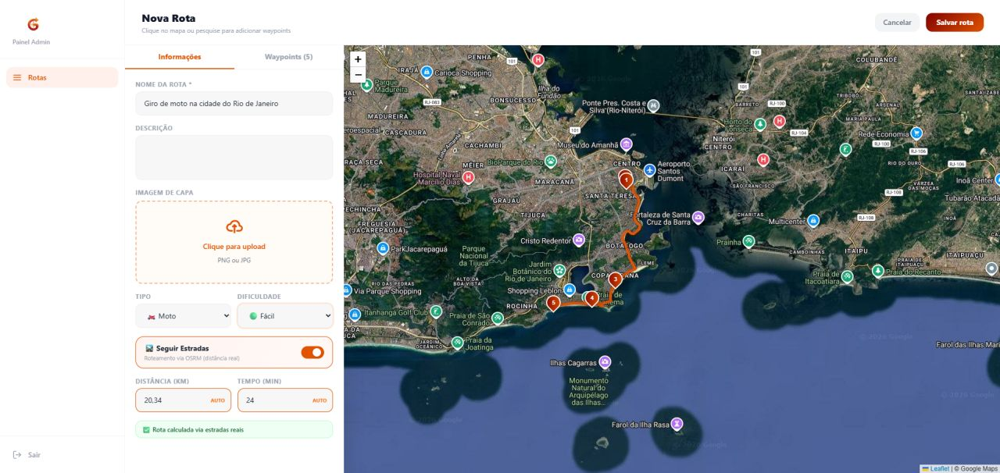
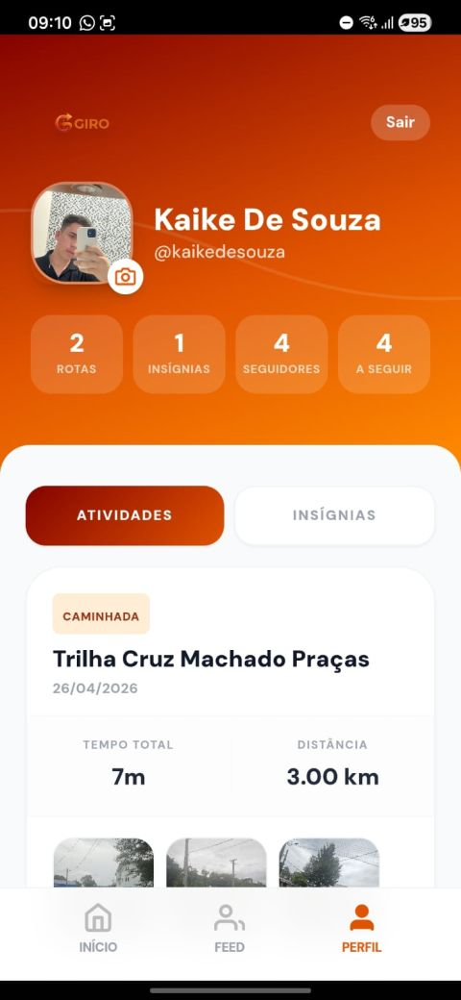
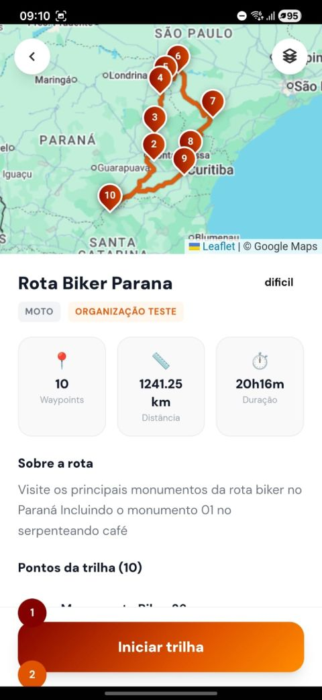
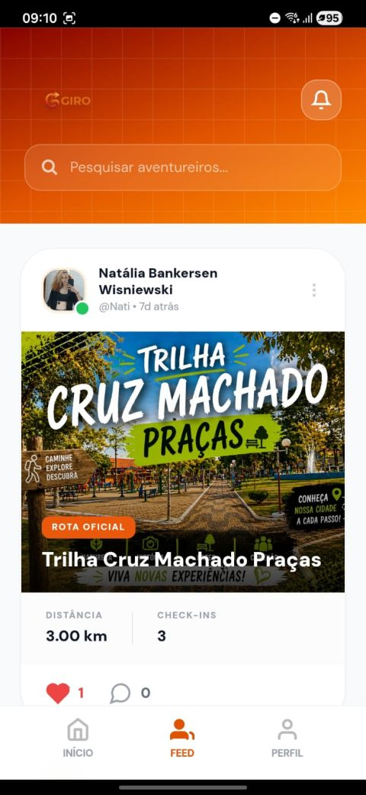

# 🏃 Giro

App mobile (Android/iOS) para rastreamento de atividades ao ar livre — corrida, caminhada, ciclismo, trilhas 4x4 e moto — com **rotas oficiais organizadas por instituições**, checkpoints validados por selfie e uma rede social de atividades no estilo Strava.

Projeto acadêmico desenvolvido como aplicação completa: app mobile nativo (Capacitor), backend com sincronização offline-first e painel administrativo para gestão de rotas.


<p align="center">
  
  
  
  
  
</p>

---

## ✨ Funcionalidades

### App mobile
- 📍 Rastreamento de atividades em tempo real (GPS): distância, ritmo, velocidade e duração, com cálculo de trajeto via geolocalização contínua
- 🏃 Suporte a diferentes tipos de atividade: corrida, ciclismo, caminhada, trilha 4x4 e moto
- 🗺️ **Rotas oficiais** criadas por organizações, com waypoints (checkpoints) fixos no percurso
- 🤳 **Check-in por selfie** em cada waypoint, com validação de proximidade (raio em metros) e score biométrico — garante que o usuário realmente esteve no local
- 🏅 Sistema de badges/conquistas por conclusão de rotas
- 📡 **Funcionamento offline-first**: atividades e check-ins são salvos localmente (SQLite via Capacitor) e sincronizados com o servidor quando a conexão volta
- 👥 Feed social: curtidas, comentários, seguir/seguidores e notificações
- 🔔 Central de notificações
- 🖼️ Compartilhamento de atividades com geração de imagem (html2canvas)

### Painel administrativo (web)
- 🏢 Gestão de organizações
- 🛣️ Criação e edição de rotas e waypoints
- ✅ Aprovação/rejeição de check-ins pendentes
- 🔐 Login administrativo separado

---

## 🛠️ Stack técnica

| Camada | Tecnologias |
|---|---|
| **App** | Next.js 16 (App Router), React 19, TypeScript, Capacitor (Android/iOS) |
| **Nativo** | Câmera, Geolocalização, Filesystem, Network, Share (plugins Capacitor) |
| **Estado** | Zustand |
| **Dados remotos** | PostgreSQL + Drizzle ORM, Supabase (Auth) |
| **Dados locais/offline** | SQLite (`@capacitor-community/sqlite`) com sincronização própria |
| **Mapas** | Leaflet / React-Leaflet |
| **UI/Utils** | Tailwind CSS, Lucide Icons, React Query, html2canvas |

---

## 🏗️ Arquitetura

O app foi desenhado **offline-first**: cada atividade e check-in é gravado localmente com um `localId` próprio e sincronizado depois com o backend (Postgres), evitando perda de dados em áreas sem sinal — um requisito importante para atividades ao ar livre.

```
├── src/app/
│   ├── (mobile)/
│   │   ├── (auth)/        # Login e cadastro
│   │   └── (app)/         # Home, atividades, mapa, feed, perfil, notificações
│   ├── (admin)/           # Painel administrativo (organizações e rotas)
│   └── api/                # Rotas de API (activities, routes, sessions, sync, feed...)
├── src/store/              # Estado global (Zustand) — rastreamento de atividade em tempo real
├── src/lib/db/
│   ├── remote/              # Schema Drizzle (PostgreSQL)
│   └── local/                # Schema SQLite (offline)
├── src/lib/sync/             # Sincronização entre dados locais e remotos
├── src/hooks/native/         # Hooks para câmera e geolocalização nativas
└── android/ · ios/            # Projetos nativos gerados pelo Capacitor
```

**Modelo de dados (resumo):** organizações → rotas → waypoints → check-ins (com selfie + score biométrico) e sessões de rota (`route_sessions`) que alimentam o feed social com curtidas, comentários e badges.

---

## 🚀 Rodando localmente

### Pré-requisitos
- Node.js 18+
- Conta Supabase (Auth) e banco PostgreSQL
- Android Studio / Xcode, se for rodar o app nativo

### Instalação

```bash
git clone https://github.com/KaikeSouza1/giroapp.git
cd giroapp
npm install
```

### Variáveis de ambiente

Crie um `.env` na raiz:

```env
DATABASE_URL=

NEXT_PUBLIC_SUPABASE_URL=
NEXT_PUBLIC_SUPABASE_ANON_KEY=
SUPABASE_SERVICE_ROLE_KEY=
```

### Banco de dados

```bash
npm run db:generate   # gera as migrations a partir do schema Drizzle
npm run db:migrate    # aplica as migrations
npm run db:studio     # abre o Drizzle Studio para visualizar os dados
```

### Rodando o app web (desenvolvimento)

```bash
npm run dev
```

### Rodando como app nativo (Android/iOS)

```bash
npm run build
npx cap sync
npx cap open android   # ou: npx cap open ios
```

---

## 📱 Telas do app

<p align="center">
  
</p>

---

## 👨‍💻 Autor

Desenvolvido por **Kaike Souza**

[](https://www.linkedin.com/in/kaike-de-souza-755595281/)
[](https://github.com/KaikeSouza1)

---

## 📄 Sobre o projeto

Giro foi desenvolvido como projeto acadêmico, explorando arquitetura offline-first, integração com hardware nativo (GPS, câmera) via Capacitor e sincronização de dados entre SQLite local e PostgreSQL remoto.
